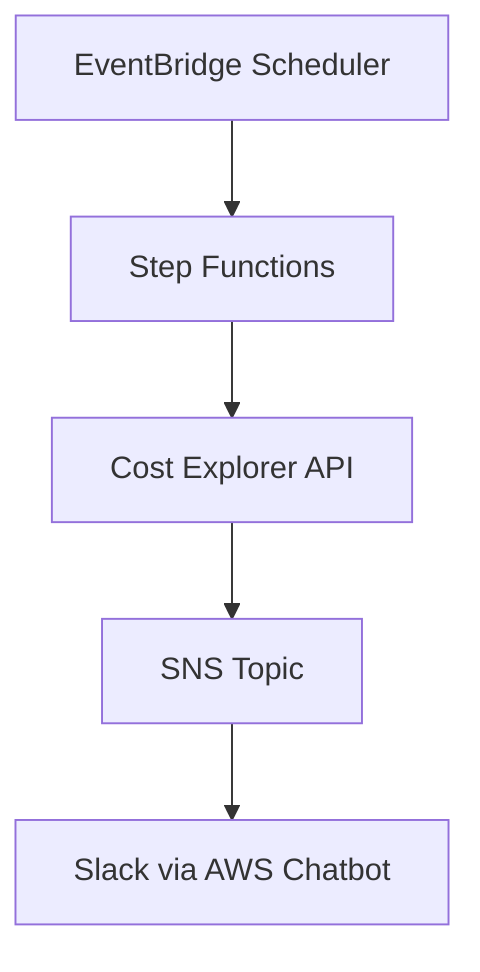

# AWS Cost Monitoring Slack Notification

AWSのコストを監視し、Slackに通知するシステムです。毎日指定した時間に、過去X日間のAWSコストを取得し、Slackチャンネルに通知します。

## 機能

- 指定した時間に自動実行
- 過去X日間のAWSコストを取得
- サービスごとのコスト内訳を表示
- コストがしきい値を超えた場合に警告メッセージを表示
- Slackへの通知

## アーキテクチャ



## 必要条件

- AWSアカウント
- Slackワークスペース
- AWS Chatbotの設定済みSlackチャンネル

## セットアップ

1. リポジトリをクローン
```bash
git clone https://github.com/nix-tkobayashi/aws-cost-monitoring-slack-notification.git
cd aws-cost-monitoring-slack-notification
```

2. `terraform.tfvars`の作成
```bash
cp terraform.tfvars.example terraform.tfvars
```

3. `terraform.tfvars`の編集
- `slack_channel_id`: SlackチャンネルID
- `slack_workspace_id`: SlackワークスペースID
- その他の設定値は必要に応じて変更

4. Terraformの実行
```bash
terraform init
terraform plan
terraform apply
```

## 設定可能なパラメータ

| パラメータ名 | 説明 | デフォルト値 |
|------------|------|------------|
| project | プロジェクト名 | aws-cost-watcher |
| slack_channel_id | SlackチャンネルID | - |
| slack_workspace_id | SlackワークスペースID | - |
| angry_threshold | コスト警告のしきい値（USD） | 10 |
| batch_schedule | バッチ実行スケジュール（cron形式） | cron(00 10 * * ? *) |
| batch_timezone | バッチ実行のタイムゾーン | Japan |
| cost_lookback_days | コスト取得の過去日数 | 7 |

## 通知内容

- 合計コスト
- サービスごとのコスト（上位5サービス）
- コストがしきい値を超えた場合の警告メッセージ

## セキュリティ

- SlackのチャンネルIDとワークスペースIDは機密情報として扱われます
- `terraform.tfvars`は`.gitignore`に追加されています

## 謝辞

このプロジェクトは、以下の記事を参考に作成されました：
- [AWS Step Functions(JSONata)でAWS料金をSlackへ通知【Lambda無し】](https://dev.classmethod.jp/articles/aws-cost-watcher-with-sfn-jsonata/)

## ライセンス

MIT License

## 作者

[nix-tkobayashi](https://github.com/nix-tkobayashi)

## 貢献

プルリクエストやイシューは歓迎します。